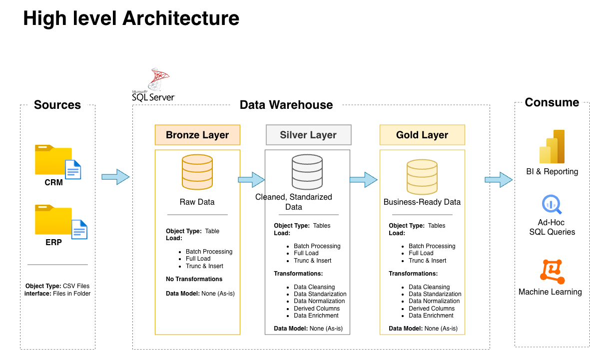
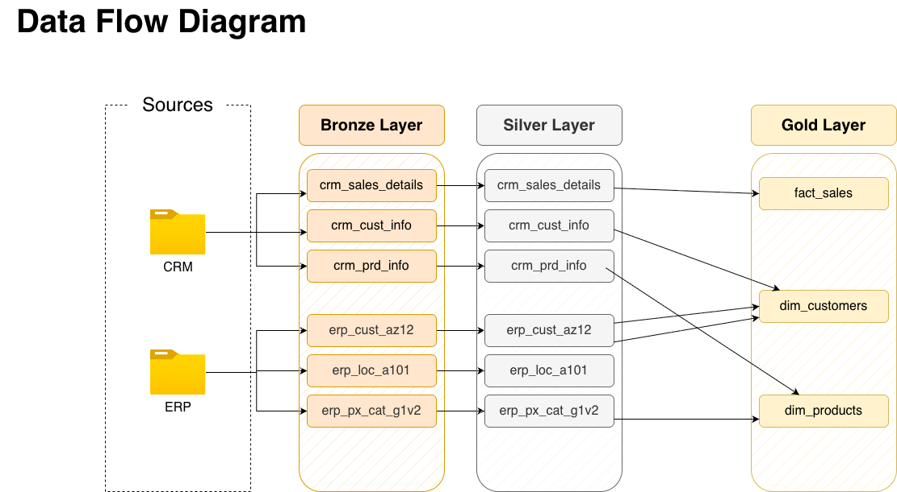
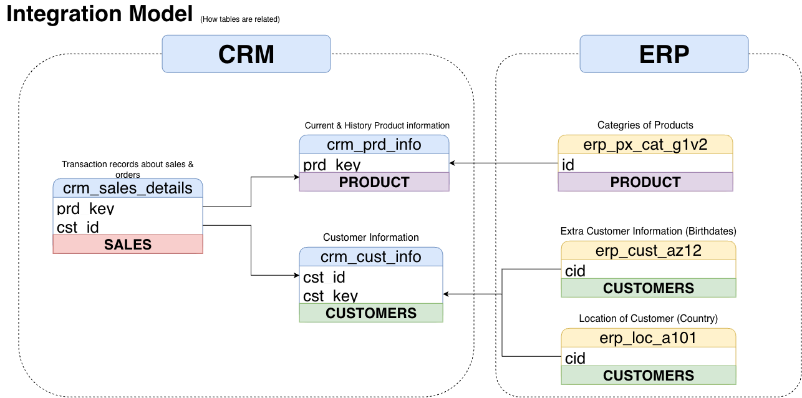
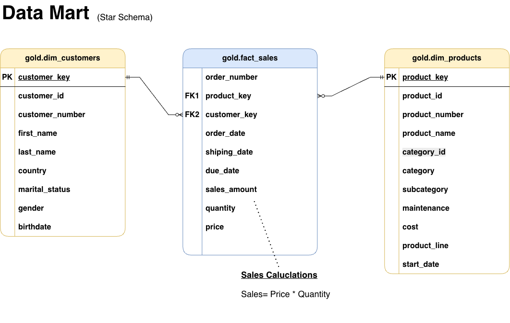

# SQL Data Warehouse Project

Welcome to my **SQL Data Warehouse Project** repository! 🚀

This project demonstrates the design and implementation of a modern SQL-based data warehouse, transforming raw CRM and ERP data into clean, integrated, and business-ready data models.

Built as a hands-on portfolio project, it demonstrates practical concepts in data warehousing, data transformation, integration, and dimensional modeling.

---

## 🏗️ Data Architecture

The data architecture for this project follows the **Medallion Architecture** with **Bronze**, **Silver**, and **Gold** layers:

<!-- Add data architecture image here -->

<!--  -->

1. **Sources**: Raw CSV files from two source systems — **CRM** and **ERP**.

2. **Bronze Layer**: Raw source data is loaded into SQL Server tables with minimal transformation.

3. **Silver Layer**: Data is cleaned, standardized, normalized, and prepared for integration.

4. **Gold Layer**: Business-ready data is modeled using fact and dimension views for analytical consumption.

---

## 🔄 Data Flow & Integration

The project documents how data moves from source systems through the warehouse layers and how data from CRM and ERP systems is integrated.

### Data Flow Diagram

Shows how source data moves through the **Bronze → Silver → Gold** layers.

<!-- Add data flow diagram image here -->

<!--  -->

### Integration Model

Shows how CRM and ERP data is related and integrated to create unified business entities.

<!-- Add integration model image here -->

<!--  -->

---

## ⭐ Data Mart (Star Schema)

The Gold layer is modeled using a **Star Schema**, consisting of:

* `gold.fact_sales`
* `gold.dim_customers`
* `gold.dim_products`

The fact view connects to the dimension views using surrogate keys.

<!-- Add data mart image here -->

<!--  -->

---

## 📖 Project Overview

This project involves:

1. **Data Architecture**: Designing a modern data warehouse using the Medallion Architecture.

2. **Data Ingestion**: Loading CRM and ERP source data into the Bronze layer.

3. **Data Transformation**: Cleaning, standardizing, and transforming data in the Silver layer.

4. **Data Integration**: Combining related data from multiple source systems into unified business entities.

5. **Data Modeling**: Developing fact and dimension objects using a Star Schema in the Gold layer.

6. **Data Quality**: Performing SQL-based quality checks to validate data and relationships.

7. **Documentation**: Creating architecture, data flow, integration, and data mart diagrams, along with a data catalog and naming conventions.

🎯 This project demonstrates practical skills in:

* SQL Development
* Data Warehousing
* Data Ingestion
* Data Transformation
* Data Integration
* Data Modeling
* Dimensional Modeling
* Star Schema
* Data Quality
* Technical Documentation

---

## 🛠️ Tools & Technologies

* **SQL Server:** Core database engine used to build the Data Warehouse.
* **Docker:** Used to run the database environment in containers.
* **DBeaver:** Database management and SQL development tool.
* **GitHub:** Version control and project hosting.
* **Draw.io:** Used to design architecture, data flow, integration, and data modeling diagrams.
* **Notion:** Used for project planning, organizing project tasks, and tracking implementation progress.

---

## 🚀 Project Requirements

### Building the Data Warehouse

#### Objective

Develop a modern data warehouse using SQL Server to consolidate CRM and ERP data and prepare it for analytical use.

#### Specifications

* **Data Sources**: Import data from CRM and ERP source systems provided as CSV files.
* **Data Quality**: Clean and resolve data quality issues before analytical use.
* **Integration**: Combine data from multiple source systems into unified business entities.
* **Data Modeling**: Develop a business-ready data model using fact and dimension objects.
* **Scope**: Focus on the latest available dataset; historization is not currently implemented.
* **Documentation**: Provide clear technical documentation of the architecture and data model.

---

## 📂 Repository Structure

```text
sql-data-warehouse/
│
├── datasets/                           # Raw datasets used for the project
│   ├── source_crm/                     # CRM source files
│   │   ├── cust_info.csv
│   │   ├── prd_info.csv
│   │   └── sales_details.csv
│   │
│   └── source_erp/                     # ERP source files
│       ├── CUST_AZ12.csv
│       ├── LOC_A101.csv
│       └── PX_CAT_G1V2.csv
│
├── docs/                               # Project documentation
│   ├── diagrams/                       # Architecture and data model diagrams
│   │   ├── data_architecture.drawio
│   │   ├── data_flow_diagram.drawio
│   │   ├── data_mart.drawio
│   │   └── integration_model.drawio
│   │
│   ├── data_catalog.md                 # Gold layer data catalog
│   └── naming_conventions.md           # Project naming conventions
│
├── scripts/                            # SQL scripts
│   ├── bronze/                         # Bronze layer loading scripts
│   ├── silver/                         # Silver layer transformation scripts
│   └── gold/                           # Gold layer data model scripts
│
├── tests/                              # Data quality and validation scripts
│
├── README.md                           # Project overview and documentation
└── LICENSE                             # License information
```

---

## 🚀 Future Enhancements

The current implementation focuses on building the Data Warehouse through the Gold layer.

Future enhancements may include:

* SQL-based business analysis
* Customer behavior analysis
* Product performance analysis
* Sales trend analysis
* Business KPIs
* Power BI dashboards
* Incremental data loading
* Historical data tracking

---

## 🛡️ License

This project is licensed under the [MIT License](LICENSE).

---

## 🌟 About Me

Hi, I'm **Hamza Rehman**, focused on building practical skills in **SQL, Data Analytics, and Data Warehousing** through hands-on projects.

This project represents my hands-on work in designing and implementing a SQL Data Warehouse, including data ingestion, transformation, integration, dimensional modeling, data quality validation, and technical documentation.

Let's connect:

* [LinkedIn](https://www.linkedin.com/in/syed-hamza-rehman-454534292/)
* [GitHub](https://github.com/hamzaa-rehman)
